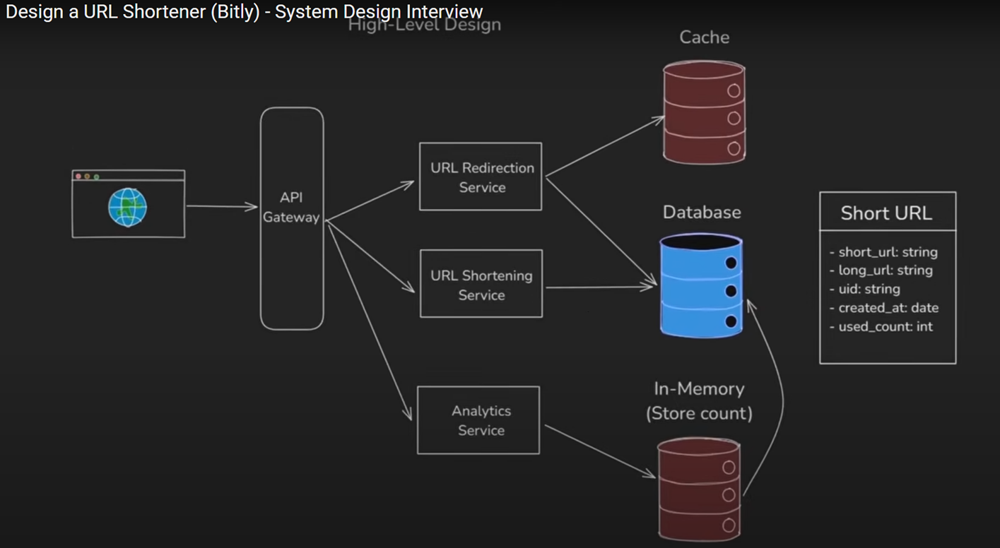

# URL Shortener

A fast, reliable URL shortener with analytics built on React + Express + MongoDB + Redis.


*System architecture diagram by NeetCode*

## What it does

- Shortens URLs (obviously)
- Redirects to original URLs 
- Shows analytics for top URLs and search
- Blocks malicious domains using a GitHub-sourced blacklist
- Caches popular URLs in Redis for speed

## Tech Stack

**Frontend:** React 18, Material-UI, React Router  
**Backend:** Express, MongoDB, Redis  
**Deployment:** Docker ready

## Quick Start

### Backend
```bash
cd server
npm install
```

Set up `.env`:
```env
DB_STRING=mongodb://localhost:27017/urlshortener
REDIS_HOST=localhost
REDIS_PORT=6379
REDIS_USERNAME=
REDIS_PASSWORD=
BASEURL=http://localhost:3000
BLACKLIST_URL=https://raw.githubusercontent.com/your-repo/blacklist.json
REDIS_BLACKLIST_KEY=url_blacklist
BLACKLIST_TTL_SECONDS=86400
TIMEZONE=UTC
```

```bash
node app.js
```

### Frontend
```bash
cd client
npm install
npm start
```

## Architecture Notes

- **Caching Strategy**: Popular URLs (80th percentile by usage) are cached in Redis
- **Database Sync**: Cache syncs with MongoDB every 6 hours via cron jobs
- **URL Safety**: Real-time blacklist checking against malicious domains
- **Short URL Generation**: 8-character hex strings with collision detection

## API Endpoints

- `POST /shorten` - Create short URL
- `GET /:shortUrl` - Redirect to original URL
- `GET /analytics/top` - Get top URLs by usage
- `GET /analytics/search?shortUrl=xxx` - Search specific URL stats

## Docker

```bash
cd server
docker build -t url-shortener .
docker run -p 8000:8000 url-shortener
```

## Performance Features

- Redis caching for hot URLs
- Percentile-based cache population
- Background blacklist updates
- Optimized MongoDB queries with lean()

Built by [@sam.wlh.ds](https://github.com/sam-wlh-ds)
